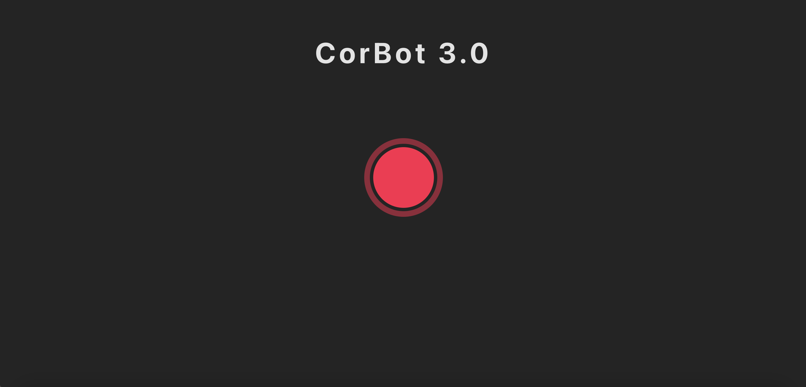

# Corbot 3.0

## Description:
This is a React application that utilizes Open AI's API for chat completion, Speech To Text, and Text To Speech with face API analyzing facial expressions. A proof of concept that allows the user to speak to a custom chatbot that can see and hear them. Currently, the bot embodies my work experience and background.

## Using the App

- Give access to camera and microphone.

- Hold the big red button to speak to CorBot.

- Ask him anything! (preferably about his work experience)

- Wait for a response.

- Have fun!

 ## [Click here to chat with CorBot.](https://corbotthree.netlify.app/)
  

